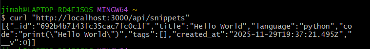

Project 2: This is a simple RESTful API for storing, retrieving, and managing code snippets. It is built using Node.js and Express, with MongoDB used as the database for persistence. This API supports full CRUD (Create, Read, Update, Delete) functionality for managing code snippets, which can be filtered by language.

Getting started:
You must have the following software installed on your system:

Node.js

npm (Node Package Manager)

A running instance of MongoDB (local or hosted)

Clone the repo → git clone YOUR_URL cd into it → npm install Create/refresh .env with MONGODB_URI + PORT npm start

Live: https://snippet-api-6hap.onrender.com/

API: All endpoints are accessed via the base URL: http://localhost:3000/api/snippets

Endpoint,Action,Suggested Status Codes
POST /api/snippets,CREATE,"201 Created (Success), 400 Bad Request (Validation error)"
GET /api/snippets,READ All,200 OK (Success)
GET /api/snippets/:id,READ One,"200 OK (Success), 404 Not Found (ID not found)"
DELETE /api/snippets/:id,DELETE,"204 No Content (Success, no response body), 404 Not Found"

1. Example using curl:

curl -X POST http://localhost:3000/api/snippets \
-H "Content-Type: application/json" \
-d '{"title": "Hello World", "language": "python", "code": "print(\"Hello World\")"}'

2. Get All Snippets
   Retrieves a list of all saved snippets.

Method: GET

URL: /api/snippets

Example:

Bash

curl "http://localhost:3000/api/snippets"

3. Get Snippets by Language (Filter)
   Retrieves snippets filtered by the specified language.

Method: GET

URL: /api/snippets?lang=<LANGUAGE>

Example (JavaScript only):

Bash

curl "http://localhost:3000/api/snippets?lang=javascript"

4. Get Single Snippet by ID
   Retrieves a single snippet using its unique MongoDB ID.

Method: GET

URL: /api/snippets/:id

5. Update a Snippet
   Modifies an existing snippet (e.g., changing the code or title).

Method: PUT or PATCH

URL: /api/snippets/:id

6. Delete a Snippet
   Removes a snippet permanently from the database.

Method: DELETE

URL: /api/snippets/:id
